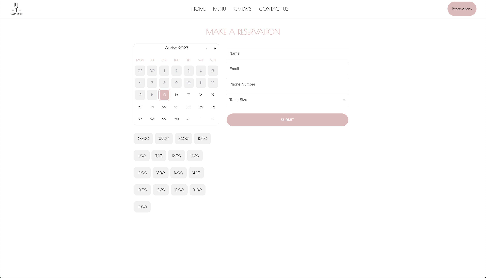
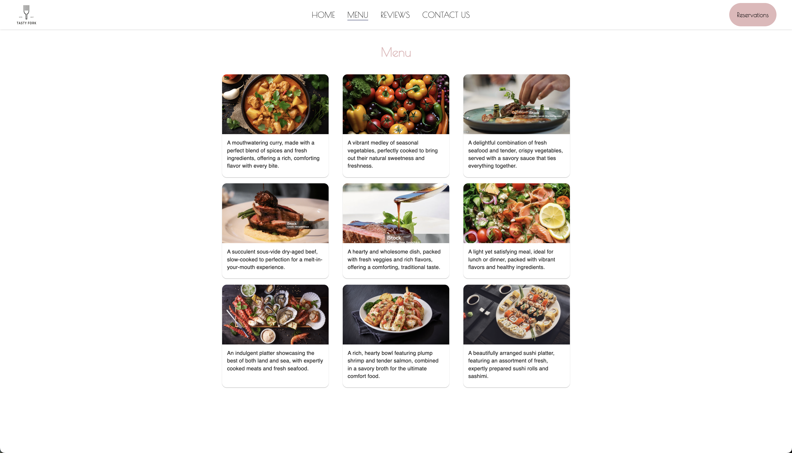
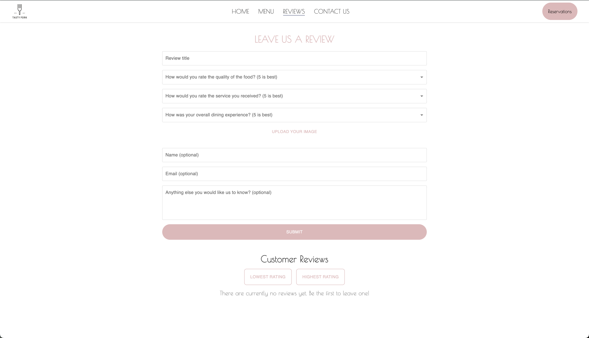
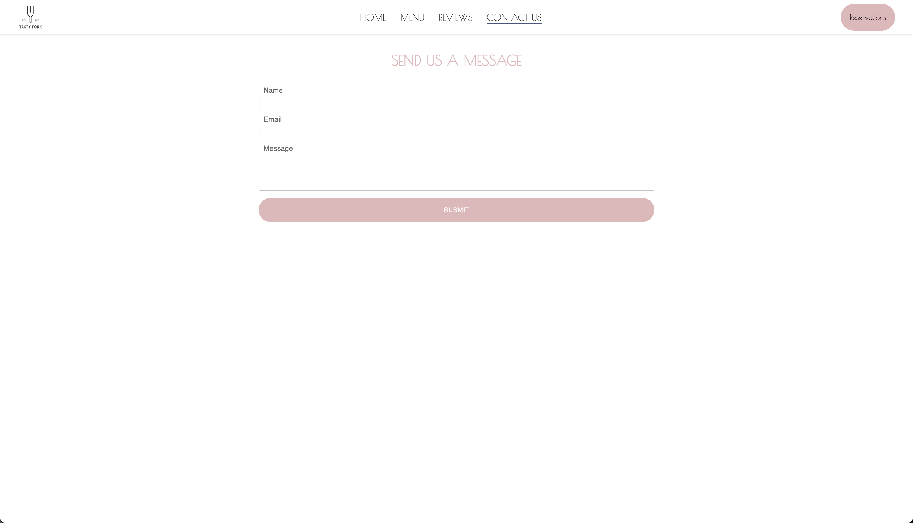

# 🍴 The Tasty Fork




## Table of Contents

1. [Summary](#summary)
2. [Motivation](#motivation)
3. [Requirements](#requirements)
4. [Tech Stack](#tech-stack)
5. [Quick Start](#quick-start)
6. [Features](#features)
7. [API Endpoints](#api-endpoints)
8. [Project Structure](#project-structure)
9. [Contributors](#contributors)
10. [Gallery](#gallery)

## Summary

"The Tasty Fork" is a full‑stack web app for a fictitious restaurant, built with React and Node.js and leveraging AWS for data storage, file uploads, and notifications. Customers can browse the menu, submit photo reviews, contact the restaurant, and book reservations, while admins manage reservations and reviews. AWS services used include DynamoDB (reservations and reviews), S3 (review photos), and SNS (SMS and email notifications).

## Motivation

The Tasty Fork was developed as a collaborative project to deepen our understanding of full‑stack web development and gain practical experience with AWS cloud services. Working as a team, we applied concepts like RESTful APIs and state management in React, while gaining hands-on experience with AWS services.

## Requirements

- Node.js 18+ and npm
- An AWS account with credentials
- Provisioned AWS resources: DynamoDB, S3 buckets, SNS topic

## Tech Stack

- **Frontend**: React, MUI, Formik, Yup,
- **Backend**: Node.js, Express
- **Cloud / Infrastructure**: AWS (DynamoDB, S3, SNS) via `aws-sdk` v2

## Quick Start

Clone the repository:

```bash
git clone https://github.com/izcheung/theTastyFork.git
cd theTastyFork
```

### Backend (Node.js + Express.js)

The server defaults to http://localhost:3000

The backend expects a `backend/config.js` module that provides AWS and resource configuration. Create `backend/config.js` with content similar to:

```javascript
// backend/config.js
module.exports = {
  awsConfig: {
    region: "YOUR_AWS_REGION",
    accessKeyId: "YOUR_ACCESS_KEY_ID",
    secretAccessKey: "YOUR_SECRET_ACCESS_KEY",
  },
  reservationTable: "YOUR_RESERVATION_TABLE_NAME",
  reviewTable: "YOUR_REVIEW_TABLE_NAME",
  contactTable: "YOUR_CONTACT_TABLE_NAME",
  s3Bucket: "YOUR_S3_BUCKET_NAME",
  snsTopicArn: "YOUR_SNS_TOPIC_ARN",
};
```

**Note**: Replace each placeholder with your actual AWS resources. Do not commit secrets to version control.

```bash
cd backend
npm install
node app.js
```

### Frontend (Vite + React)

The app runs at the local URL printed by Vite (default: http://localhost:5173).

```bash
cd frontend
npm install
npm run dev
```

## Features

- Menu Browsing: Users can explore the menu.

- Reservations: Customers can book a table, receive SMS confirmations (via AWS SNS), and the reservation is stored in DynamoDB.

- Reviews: Users can submit reviews with optional photos uploaded to S3, stored in DynamoDB.

- Contact Form: Sends messages to admins via SNS email subscription.

- Admin Management: View, update, or cancel reservations and manage reviews.

## API Endpoints

The backend mounts the following route modules in `backend/app.js`:

- `review.js`
  - `POST /submitReview` → Create review (with optional photo upload to S3); persists to DynamoDB
  - `GET /fetchReviews` → List reviews from DynamoDB
  - `DELETE /api/admin/review/:id` → Admin deletes a review
- `reservation.js`
  - `POST /api/reservations` → Create reservation, save to DynamoDB, send SMS via SNS
  - `GET  /api/reservations` → List reservations
- `adminReservation.js`
  - `GET    /api/admin/reservations` → Admin lists reservations
  - `PUT    /api/admin/reservations/:id` → Admin updates reservation and re‑notifies via SNS
  - `DELETE /api/admin/reservations/:id` → Admin cancels reservation and notifies via SNS
- `contact.js`
  - `POST /api/contact` → Save message to DynamoDB, send email via SNS
  - `GET  /api/contact` → List contact messages

## Project Structure

```
.
├── backend
│   ├── adminReservation.js   # Routes for admin reservation management
│   ├── app.js                # Main Express app entry point
│   ├── contact.js            # Routes for contact form handling
│   ├── package-lock.json
│   ├── package.json
│   ├── reservation.js        # Routes for customer reservations
│   └── review.js             # Routes for reviews (with optional S3 photo uploads)
├── frontend
│   ├── eslint.config.js      # ESLint configuration for linting
│   ├── index.html
│   ├── package-lock.json
│   ├── package.json
│   ├── src
│   │   ├── App.css            # Global app styles
│   │   ├── App.jsx            # Main app component
│   │   ├── assets             # Project-specific assets (images, icons, etc.)
│   │   ├── components         # Reusable React components
│   │   ├── constants          # App constants and config values
│   │   ├── index.css          # CSS entry point
│   │   ├── main.jsx           # React DOM render entry
│   │   └── pages              # Page-level React components (views)
│   └── vite.config.js
└── README.md
```

## Contributors

- Irene Cheung
- Hsin Pang
- Elena Zhu

## Gallery




